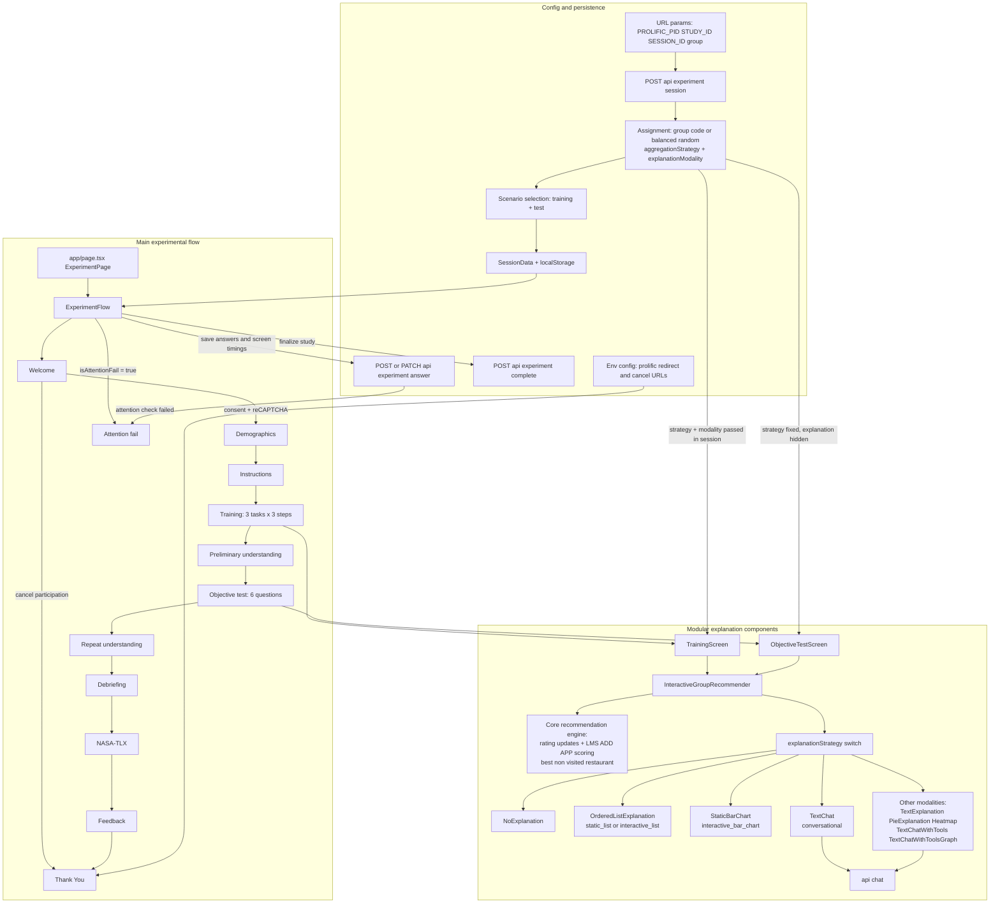

# FIRE: Framework for Interactive Recommender Explanations

A research application for studying interactive group recommendation systems with various explanation strategies. This project allows users to explore different aggregation strategies for group decision-making and compare multiple explanation approaches to understand how recommendations are generated.

## 🎯 Overview

This application simulates a group restaurant recommendation scenario where 5 people (Darcy, Alex, Jess, Jackie, and Freddy) rate restaurants on a 1-5 scale. The system then uses different aggregation strategies to recommend the best restaurant for the group, with various explanation methods to help users understand the decision-making process.

## 🚀 Features

### Aggregation Strategies

- **LMS (Least Misery Strategy)**: Minimizes the lowest rating among group members
- **ADD (Additive Strategy)**: Maximizes the total rating sum across all group members
- **APP (Approval Voting Strategy)**: Maximizes the number of ratings above 3

### Explanation Strategies

The experiment uses five explanation modalities (one per condition):

- **No Explanation**: Simple recommendation without explanation
- **Static List**: Ranked list with scores (read-only)
- **Interactive List**: Ranked list with editable ratings
- **Conversational**: AI-powered chat to answer questions about recommendations
- **Interactive Bar Chart**: Bar chart with sliders to adjust ratings and see impact

Additional explanation styles available in the admin preview: Text, Pie Chart, Heatmap, Ordered List, and Chat with Tools.

### Interactive Features

- **Real-time Rating Updates**: Modify ratings and see immediate impact on recommendations
- **Scenario Management**: Switch between different pre-defined scenarios
- **Sorting Options**: Sort restaurants from best to worst
- **Visual Fading**: Fade non-contributing elements for better focus
- **Reset Functionality**: Reset ratings to initial values

## 🛠️ Technology Stack

- **Frontend**: Next.js 15.5.3 with React 19.1.0
- **Styling**: Tailwind CSS 4
- **UI Components**: Radix UI primitives
- **Data Visualization**: D3.js 7.9.0
- **AI Integration**: AI SDK with Cerebras (default), Scaleway (EU), or Requesty models
- **Type Safety**: TypeScript 5
- **Package Manager**: pnpm
- **Onboarding flow**: https://nextstepjs.com/

## 📦 Installation

1. **Clone the repository**

   ```bash
   git clone <repository-url>
   cd interactive-group-explanations
   ```

2. **Install dependencies**

   ```bash
   pnpm install
   ```

3. **Set up environment variables**
   Create a `.env.local` file in the root directory. Required variables include:

   ```env
   DATABASE_URL='postgresql://...'
   NEXT_PUBLIC_RECAPTCHA_SITE_KEY=...
   RECAPTCHA_SECRET_KEY=...
   NEXT_PUBLIC_PROLIFIC_REDIRECT_URL="https://app.prolific.com/submissions/complete?cc=YOUR_COMPLETION_CODE"
   NEXT_PUBLIC_PROLIFIC_CANCEL_URL="https://app.prolific.com/submissions/complete?cc=YOUR_RETURN_CODE"
   NEXT_PUBLIC_PROLIFIC_FAILED_ATTENTION_CHECK_CODE="https://app.prolific.com/submissions/complete?cc=YOUR_FAILED_ATTENTION_CHECK_CODE"
   ```

   **LLM provider (chat explanations):**
   - `LLM_PROVIDER`: `'cerebras'` (default), `'scaleway'`, or `'requesty'`. Use `scaleway` for EU-hosted models (privacy).
   - `LLM_MODEL`: Model ID for the conversational chat (e.g. `llama3.1-8b` for Cerebras, `llama-3.1-8b-instruct` for Scaleway, `openai/gpt-4o-mini` for Requesty). A single model handles all question types.
   - For Scaleway: `LLM_API_KEY` (required when `LLM_PROVIDER=scaleway`).
   - For Requesty: `LLM_API_KEY`, `LLM_BASE_URL` (optional, defaults to `https://router.requesty.ai/v1`), `LLM_MODEL` (optional default model).

   See the project for additional keys (API keys, admin password, etc.).

4. **Run the development server**

   ```bash
   pnpm dev
   ```

5. **Open your browser**
   Navigate to [http://localhost:3000](http://localhost:3000)

### Conversational chat (Chat API)

The chat explanation uses a **single LLM** with no tool calling. The model answers directly from the context data (ratings, scores, strategy) injected into the system prompt.

- **Architecture**: `POST /api/chat` calls `streamText` with the system prompt and conversation history. No tools, no intent detection, no separate counterfactual model.
- **Model selection**: `LLM_MODEL` env var (or provider default) is used for all question types.
- **Context**: Full ratings matrix, group scores, and strategy are included in every request via the last user message’s metadata.
- **Message sanitization**: Consecutive user messages (e.g. after empty responses) are avoided by inserting placeholder assistant messages, preventing cascading empty completions.

**Prompt behavior**:

- **Score definition**: “Score” is the strategy score (LMS = min rating, ADD = sum, APP = approvals ≥ 4).
- **Ranking format**: For “What is the recommended restaurant order?” and similar queries, the model must return a full ranking with:
  - One line per score group (ties on the same line, comma-separated).
  - Score and status tags (e.g. “recommended”, “already visited”) for each group.
- **Counterfactuals**: For “how to make X preferred”, the model proposes concrete rating changes from the context data; no external verification.

## Running the experiment

The app runs a multi-step experiment (~20–30 minutes) where participants interact with group recommendation scenarios and answer questions. Participants are assigned to one of 15 conditions (3 aggregation strategies × 5 explanation modalities) either randomly or via a `group` URL parameter.

### Experiment flow

1. **Welcome** — Informed consent, checkboxes, reCAPTCHA, "Start experiment" / "Cancel participation"
2. **Demographics** — Optional age range and gender
3. **Instructions** — Overview of the task
4. **Training** — 3 scenarios to familiarize with the system
5. **Preliminary understanding** — 7-point Likert scales
6. **Objective test** — 6 scenarios with questions (model simulation, counterfactual, error detection)
7. **Repeat understanding** — Same Likert scales as step 5
8. **Debriefing** — Free-text explanation for the group
9. **NASA-TLX** — Cognitive load assessment
10. **Feedback** — Optional free-text feedback
11. **Thank you** — Summary and "Return to Prolific" (or equivalent) button

Participants who fail attention checks are routed to an **Attention fail** screen instead of continuing.

### Application architecture overview



### Prolific

For participants recruited via [Prolific](https://www.prolific.com):

1. **Study URL** — Set your study URL to your app’s base URL (e.g. `https://your-domain.com/`).
2. **URL parameters** — Enable "I'll use URL parameters" so Prolific appends `PROLIFIC_PID`, `STUDY_ID`, and `SESSION_ID`.
3. **Completion codes** — In Prolific’s Completion codes section, create:
   - A **completion code** for successful finishes
   - A **return/incomplete code** for withdrawals and failed attention checks
4. **Environment variables** — Set in `.env.local`:
   ```env
   NEXT_PUBLIC_PROLIFIC_REDIRECT_URL="https://app.prolific.com/submissions/complete?cc=YOUR_COMPLETION_CODE"
   NEXT_PUBLIC_PROLIFIC_CANCEL_URL="https://app.prolific.com/submissions/complete?cc=YOUR_RETURN_CODE"
   NEXT_PUBLIC_PROLIFIC_FAILED_ATTENTION_CHECK_CODE="https://app.prolific.com/submissions/complete?cc=YOUR_FAILED_ATTENTION_CHECK_CODE"
   ```

On the Thank you screen, participants who completed the study are redirected to the completion URL; those who withdrew are redirected to the cancel URL. Participants who fail attention checks are redirected to the failed attention check URL.

**Optional:** Use a `group` query parameter (e.g. `?group=ADST`) to assign specific conditions. Valid codes are listed in `GROUP_CODES` in `src/lib/experiment-utils.ts`.

### Non-Prolific

For self-recruited or non-Prolific participants:

1. Share the app URL without query parameters: `https://your-domain.com/`
2. Sessions are created with no Prolific IDs; condition assignment is random and balanced.
3. On the Thank you screen, the "Return to Prolific" button redirects to the configured URLs: completion URL for those who finished the study, cancel URL for those who withdrew before creating a session (e.g. on the Welcome screen). You can point these URLs to a custom landing page instead of Prolific if needed.

## 🎮 Usage

### Basic Workflow

1. **Select Strategy**: Choose an aggregation strategy (LMS, ADD, or APP) from the settings panel
2. **Choose Explanation**: Select your preferred explanation method
3. **Interact with Ratings**: Modify individual ratings in the table to see real-time updates
4. **Explore Explanations**: Use the explanation panel to understand how recommendations are generated
5. **Ask Questions**: In chat mode, ask the AI about the recommendations or simulate changes

### Settings Panel

Access the settings panel by clicking the gear icon in the top-left corner (admin preview):

- **Aggregation Strategy**: Switch between LMS, ADD, and APP
- **Explanation Strategy**: Choose from various explanation methods
- **Sort Best to Worst**: Enable/disable restaurant sorting
- **Fade Non-Contributing**: Highlight only relevant elements
- **Scenario Selection**: Pick from pre-defined scenarios or get random ones

### URL Parameters

You can link directly to specific scenarios using URL parameters:

```
http://localhost:3000?scenario=add1
```

## 📊 Data Structure

### Scenarios

The application includes numerous pre-defined scenarios optimized for different strategies:

- **Additive scenarios**: Designed to showcase ADD strategy benefits
- **LMS scenarios**: Optimized for Least Misery Strategy
- **Approval Voting scenarios**: Tailored for the APP strategy

Each scenario includes:

- 5 group members with distinct preferences
- 10 restaurants (some previously visited)
- Pre-defined rating matrices
- Visit history and ordering

### Rating System

- **Scale**: 1-5 (1 = strongly dislike, 5 = strongly like)
- **Matrix**: 5 people × 10 restaurants
- **Constraints**: Previously visited restaurants cannot be re-rated

## 🔬 Research Applications

This application is designed for research in:

- **Group Decision Making**: Understanding how different aggregation strategies affect outcomes
- **Explanation Interfaces**: Comparing effectiveness of various explanation methods
- **User Experience**: Studying how different visualizations impact user understanding
- **Interactive Systems**: Exploring real-time feedback and user interaction patterns

## 🏗️ Project Structure

```
src/
├── app/                      # Next.js app router
│   ├── api/                  # API routes (chat, experiment, admin)
│   ├── admin/                # Admin and preview pages
│   ├── layout.tsx
│   └── page.tsx              # Experiment entry point
├── components/
│   ├── admin/                # Admin dashboard and preview
│   ├── answer-options/       # Survey question components
│   ├── chat/                 # Chat UI
│   ├── experiment/           # Experiment flow and screens
│   ├── explanation-styles/    # Explanation modalities (NoExplanation, TextChat, Heatmap, etc.)
│   ├── ai-elements/          # AI chat UI primitives
│   └── ui/                   # Reusable UI components
└── lib/                      # Utilities, scenarios, experiment logic
```

## 🧪 Development

### Available Scripts

- `pnpm dev`: Start development server with Turbopack
- `pnpm build`: Build for production with Turbopack
- `pnpm start`: Start production server
- `pnpm lint`: Run ESLint

### Key Components

- **InteractiveGroupRecommender**: Main recommendation component with ratings table and explanation panel
- **ExperimentFlow**: Orchestrates the multi-screen experiment (welcome, training, objective test, etc.)
- **SettingsSidebar**: Configuration panel (admin preview)
- **explanation-styles/**: NoExplanation, OrderedListExplanation, StaticBarChart, TextChat, TextChatWithTools, Heatmap, PieExplanation, TextExplanation
- **AI Chat** (`api/chat`): Single-LLM conversational explanations; context (ratings, scores) passed in the system prompt

## 🤝 Contributing

This is a research project. For contributions:

1. Fork the repository
2. Create a feature branch
3. Make your changes
4. Test thoroughly
5. Submit a pull request

## 📄 License

This project is part of academic research. Please cite appropriately if used in research.

## 🔗 Related Work

This application supports research in:

- Interactive Group Recommender Systems
- Explanation Interfaces for AI Systems
- User Experience in Decision Support Tools
- Comparative Studies of Aggregation Strategies

---

_Built for research in interactive group recommendation systems and explanation interfaces._
