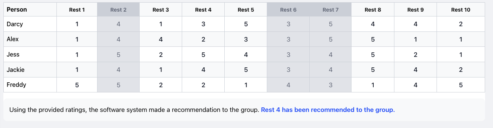
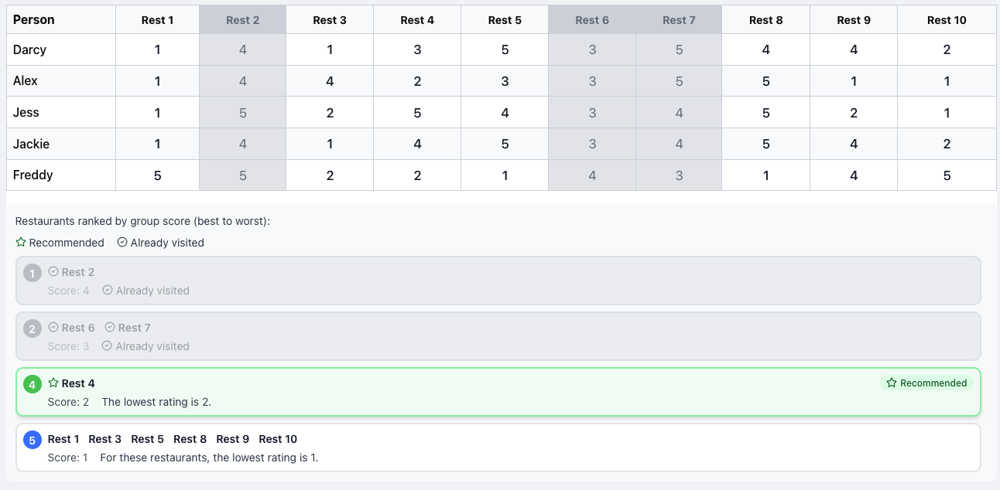
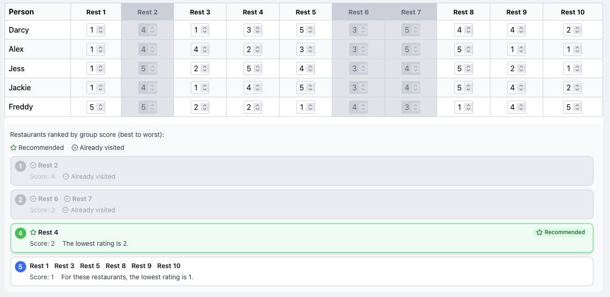
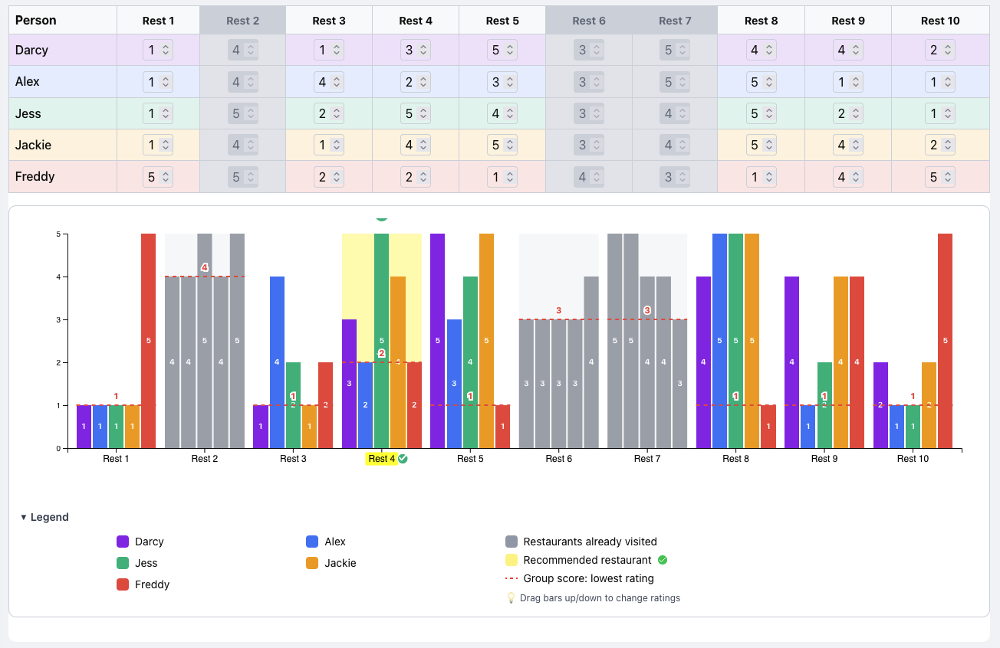
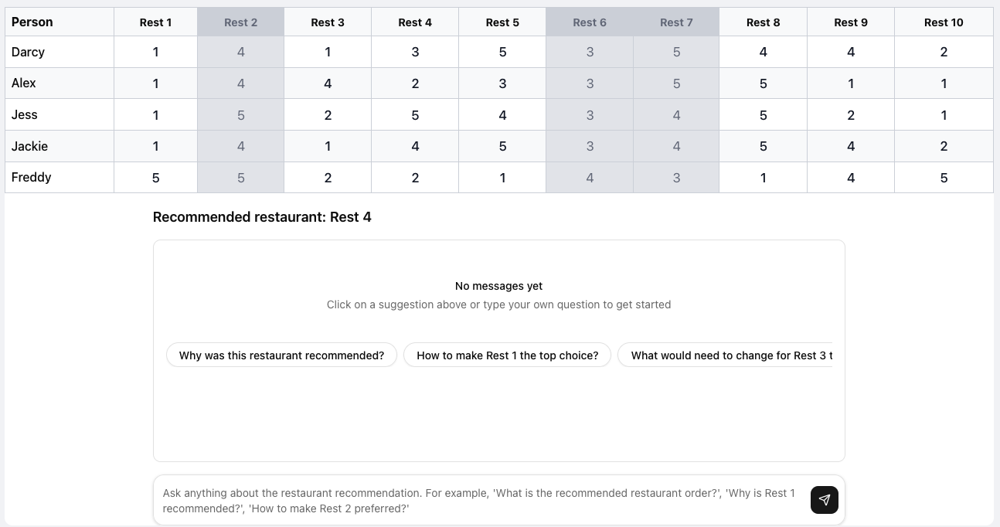
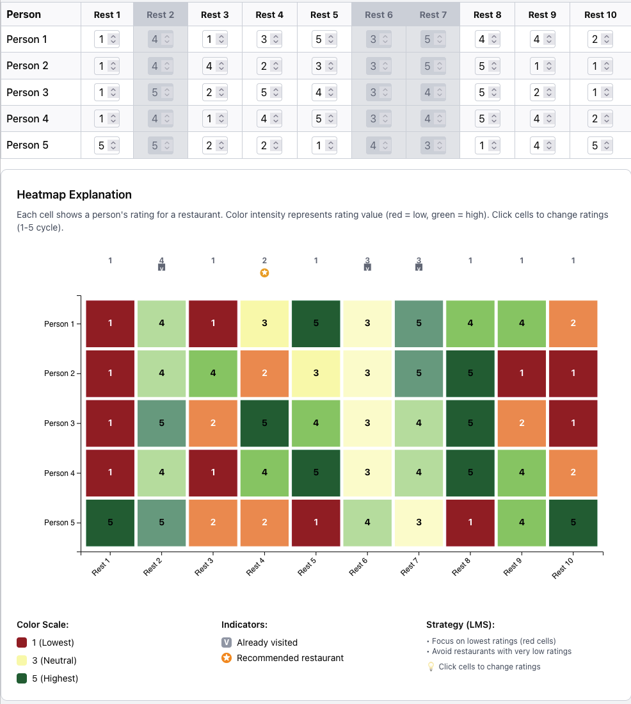
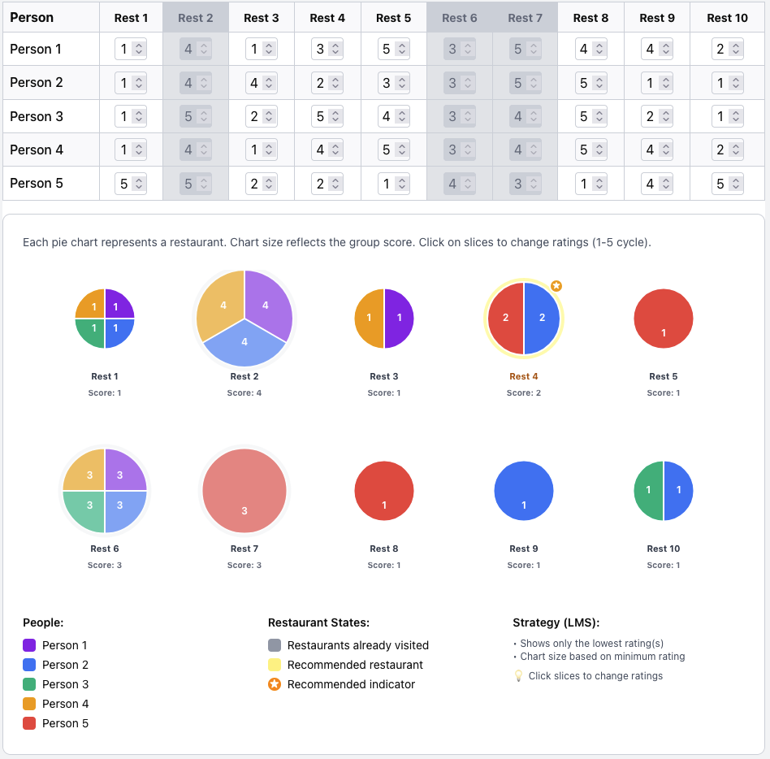

# Explanation Styles Overview

This document provides an overview of the different explanation styles available in the Interactive Group Recommender, with screenshots for each.

---

## 0. No Explanation

**Strategy ID:** `no_expl`

**Component:** `NoExplanation`

**Description:** A baseline condition with no explanation of *why* the recommendation was made. Users only see which restaurant(s) have been recommended, with no rationale based on the aggregation strategy (LMS, ADD, or APP).

**Interactivity:** The ratings table is read-only.

--- togg

## 1. Static List

**Strategy ID:** `static_list`

**Component:** `OrderedListExplanation`

**Description:** Restaurants are displayed in a ranked list (best to worst) with their group scores. Each entry includes a strategy-specific explanation (e.g., "The lowest rating is X" for LMS, "The total rating is X" for ADD). Recommended restaurants are highlighted with a star icon; already-visited restaurants are marked with a check.

**Interactivity:** The ratings table is read-only. Users cannot modify ratings.

---

## 2. Interactive List

**Strategy ID:** `interactive_list`

**Component:** `OrderedListExplanation`

**Description:** Same ranked list visualization as the Static List, but the ratings table is interactive. Users can change ratings and see the list update in real time as group scores and rankings change.

**Interactivity:** The ratings table is editable. Changes propagate to the explanation.

---

## 3. Interactive Graph

**Strategy ID:** `interactive_bar_chart` / `graph_expl`

**Component:** `StaticBarChart` (wraps `InteractiveBarChart`)

**Description:** A bar chart visualization inspired by TasteWeights (ACM 2012). Each restaurant shows stacked or grouped bars for each group member's rating. Color-coded by person, with optional fading of non-contributing ratings (e.g., for LMS, only the minimum rating matters; for APP, only ratings > 3 are shown). Users can adjust ratings via sliders or direct interaction.

**Interactivity:** The ratings table is editable. Person rows are tinted by their color. The chart updates when ratings change.

---

## 4. Conversational

**Strategy ID:** `conversational` / `chat_expl_basic`

**Component:** `TextChat` (Conversational)

**Description:** A chat interface where users can ask questions about the recommendation in natural language. Suggestion prompts (e.g., "Why was this restaurant recommended?", "How to make Rest 1 the top choice?") help users explore. The system uses an AI model to answer questions about the recommendation, aggregation strategy, and individual ratings.

**Interactivity:** The ratings table is read-only. Users interact via chat.

---

## 5. Heatmap

**Strategy ID:** `heatmap_expl`

**Component:** `Heatmap`

**Description:** A D3-based heatmap showing people (rows) × restaurants (columns). Each cell is colored by rating (1–5) using a red–yellow–green gradient. Recommended restaurants are highlighted. Users can click cells to change ratings and observe how the recommendation updates.

**Interactivity:** The ratings table is editable. Changes propagate to the heatmap and recommendation.

---

## 6. Pie Chart

**Strategy ID:** `pie_expl`

**Component:** `PieExplanation`

**Description:** A pie chart visualization per restaurant (based on IEEE 2017). The chart adapts to the aggregation strategy: LMS shows only the lowest raters; ADD shows all ratings weighted by value; APP shows only approval votes (ratings > 3). Users can adjust ratings and see how the pie slices and recommendation change.

**Interactivity:** The ratings table is editable. Changes propagate to the pie charts and recommendation.

---

## Other Explanation Styles (no screenshots)

| Strategy ID | Component | Description |
|-------------|-----------|-------------|
| `text_expl` | `TextExplanation` | Text-based explanation with rationale (e.g., "because it has the highest total rating sum among all group members"). |
| `ordered_list_expl` | `OrderedListExplanation` | Same as Static/Interactive List. |
| `chat_expl` | — | Legacy conversational. |
| `chat_expl_with_tools` | — | Conversational with tools (not currently implemented). |
| `chat_expl_with_tools_graph` | — | Conversational with tools + graph (not currently implemented). |

---

## Screenshot Location

All screenshots are stored in `public/screenshots/explanation-styles/`:

- `0_no_explanation.png`
- `1_static_list.png`
- `2_interactive_list.png`
- `3_interactive_graph.png`
- `4_conversational.png` (also `4_conversational_cropped.png`)
- `5_heatmap.png`
- `6_pie_chart.png`
